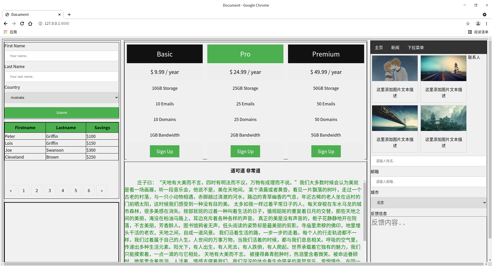
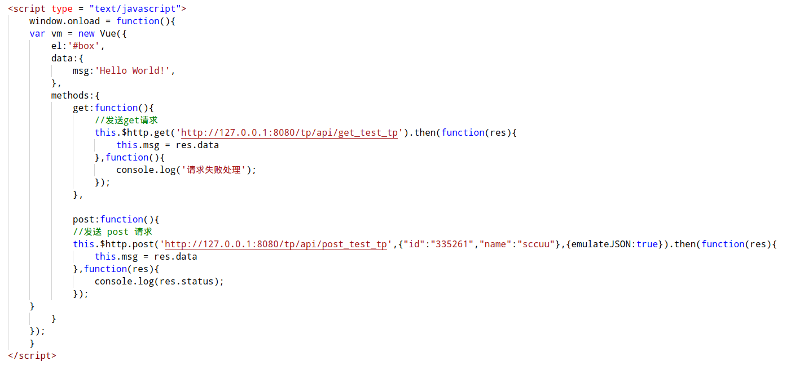
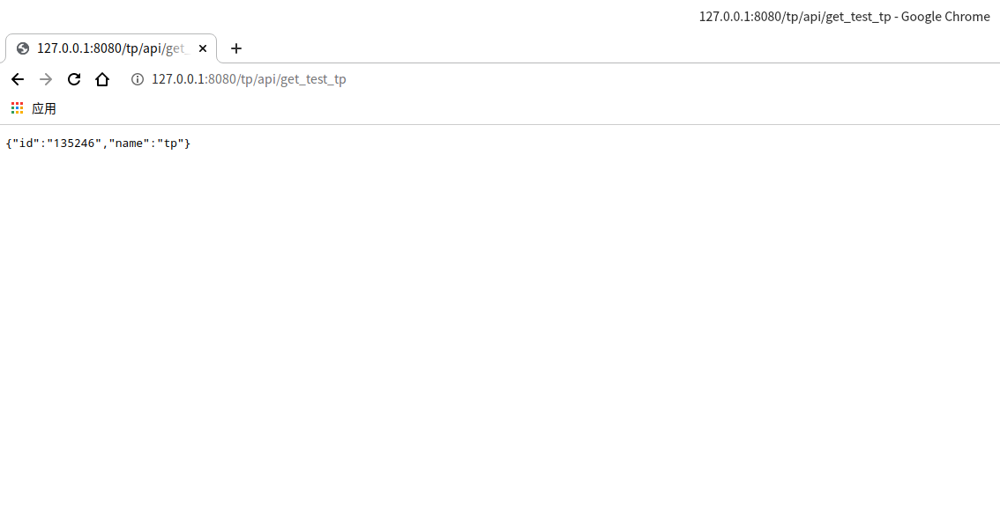

# HttpWebServer
## 项目简介

​	HttpWebServer是一个轻量级高性能的HTTP的web服务器，服务开发框架是Qt和nginx组合的HTTP服务器开发框架。Nginx能够支撑5万并发连接，实际生产环境中可以支撑2~4万并发连接数，Nginx服务器，在3万并发连接下，开启10个Nginx进程消耗150MB内存。Qt 是一个优秀的 C++ 应用程序框架，在一定程度上你获得的是一个“一站式”的解决方案：不再需要研究 STL，不再需要 C++ 的<string>，不再需要到处去找解析 XML、连接数据库、访问网络的各种第三方库，因为 Qt 自己内置了这些技术。把nginx框架预先编译成动态库，当作Qt模块的动态库一样。编译程序通过prf文件，查找链接所需要nginx动态库。pro工程文件包含2个子工程，分别是nginx主程序编译成执行程序，nginx请求处理的程序编译程动态库。C程序调用c++程序，使用了c++11的__cplusplus宏定义。

## 程序演示

​	如果当前环境没有配置MySQL数据库，程序编译不通过，屏蔽报错位置的代码，程序正常运行．

启动程序，浏览器输入 http://127.0.0.1:8080/，如下

 前端网页使用 html + js + css 技术， 使用渐进式开发框架Vue.js 2，请求后端使用 [axios](https://www.runoob.com/vue2/vuejs-ajax-axios.html) 来完成 ajax 请求。	

​	测试get请求，浏览器输入 http://127.0.0.1:8080/tp/api/get_test_tp，如下

​	测试post请求，浏览器输入 http://127.0.0.1:8080/tp/api/post_test_tp，如下

## Deepin(uos) 安装MySQL

添加阿里的镜像源

deb http://mirrors.aliyun.com/ubuntu/ bionic main restricted universe multiverse
deb http://mirrors.aliyun.com/ubuntu/ bionic-security main restricted universe multiverse
deb http://mirrors.aliyun.com/ubuntu/ bionic-updates main restricted universe multiverse
deb http://mirrors.aliyun.com/ubuntu/ bionic-proposed main restricted universe multiverse
deb http://mirrors.aliyun.com/ubuntu/ bionic-backports main restricted universe multiverse
deb-src http://mirrors.aliyun.com/ubuntu/ bionic main restricted universe multiverse
deb-src http://mirrors.aliyun.com/ubuntu/ bionic-security main restricted universe multiverse
deb-src http://mirrors.aliyun.com/ubuntu/ bionic-updates main restricted universe multiverse
deb-src http://mirrors.aliyun.com/ubuntu/ bionic-proposed main restricted universe multiverse
deb-src http://mirrors.aliyun.com/ubuntu/ bionic-backports main restricted universe multiverse

sudo apt-key adv --recv-keys --keyserver keyserver.ubuntu.com 40976EAF437D05B5 3B4FE6ACC0B21F32

sudo apt-get install mysql-server 

sudo mysql_secure_installation

sudo mysql -uroot -p

GRANT ALL PRIVILEGES ON *.* TO root@localhost IDENTIFIED BY "123456";

##1 创建数据库weixx
CREATE DATABASE weixx;
##2 创建用户wxx(密码654321) 并允许wxx用户可以从任意机器上登入mysql的weixx数据库
GRANT ALL PRIVILEGES ON weixx.* TO wxx@"%" IDENTIFIED BY "654321"; 

sudo apt-get mysql-client

sudo apt-get install libmysqlclient-dev
